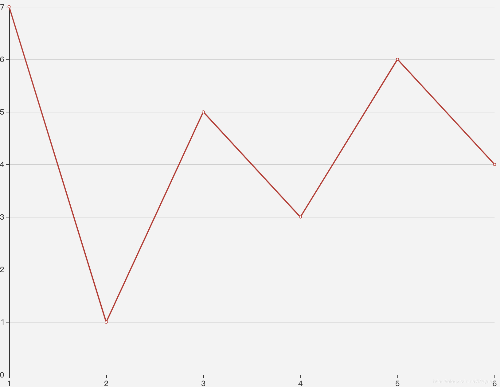

## 买卖股票的最佳时机（单笔交易）
给定一个数组，它的第  i 个元素是一支给定股票第 i 天的价格。

如果你最多只允许完成一笔交易（即买入和卖出一支股票），设计一个算法来计算你所能获取的最大利润。

注意你不能在买入股票前卖出股票。

示例 1:

```
输入: [7,1,5,3,6,4]
输出: 5
解释: 在第 2 天（股票价格 = 1）的时候买入，在第 5 天（股票价格 = 6）的时候卖出，最大利润 = 6-1 = 5 。
     注意利润不能是 7-1 = 6, 因为卖出价格需要大于买入价格。
```

示例 2:
 
```
输入: [7,6,4,3,1]
输出: 0
解释: 在这种情况下, 没有交易完成, 所以最大利润为 0。
```
From: [买卖股票的最佳时机](https://leetcode-cn.com/problems/best-time-to-buy-and-sell-stock/submissions/)

### 分析
由于每次交易的值``minItem``只会影响后面的结果，因此每次位移取位移中较小的值
用较小的值和当前的值做差值``diff``，并与之前的``oldDiff``做比较，取较大的值

### 解答
```javascript
/**
 * @param {number[]} prices
 * @return {number}
 */
var maxProfit = function(prices) {
  let max = 0;
  let minItem = prices[ 0 ];
  for (let i = 1; i < prices.length; i++) {
    if (prices[ i ] > minItem) {
      max = Math.max(max, prices[ i ] - minItem);
    } else {
      // 更新最小值
      minItem = prices[ i ];
    }
  }
  return max;
}
```


## 买卖股票的最佳时机（多笔交易）
给定一个数组，它的第  i 个元素是一支给定股票第 i 天的价格。

设计一个算法来计算你所能获取的最大利润。你可以尽可能地完成更多的交易（多次买卖一支股票）。

注意：你不能同时参与多笔交易（你必须在再次购买前出售掉之前的股票）。

示例 1:

```
输入: [7,1,5,3,6,4]
输出: 7
解释: 在第 2 天（股票价格 = 1）的时候买入，在第 3 天（股票价格 = 5）的时候卖出, 这笔交易所能获得利润 = 5-1 = 4 。
随后，在第 4 天（股票价格 = 3）的时候买入，在第 5 天（股票价格 = 6）的时候卖出, 这笔交易所能获得利润 = 6-3 = 3 。
```

示例 2:

```
输入: [1,2,3,4,5]
输出: 4
解释: 在第 1 天（股票价格 = 1）的时候买入，在第 5 天 （股票价格 = 5）的时候卖出, 这笔交易所能获得利润 = 5-1 = 4 。
注意你不能在第 1 天和第 2 天接连购买股票，之后再将它们卖出。
因为这样属于同时参与了多笔交易，你必须在再次购买前出售掉之前的股票。
```

示例  3:

```
输入: [7,6,4,3,1]
输出: 0
解释: 在这种情况下, 没有交易完成, 所以最大利润为 0。
```

### 分析
以 [7,1,5,3,6,4] 数据为例，展示在线形图上：

这里可以看出在

第2天买入第3天卖出，能赚得4元

第4天买入第5天卖出，能赚得3元

因此最多可赚7元

观察图形可以得出盈利图形就会上升，而升序的区间就是盈利区间，在这个图形中则是[ 2, 3 ]和[ 4, 5 ]，因此只要得出所有盈利区间总和即可

### 解答
```javascript
var maxProfit = function(prices) {
  let res = 0;
  for (let i = 1; i < prices.length; i++) {
    let diff = prices[i] - prices[i - 1];
    if (diff > 0) {
      res += diff;
    }
  }
  return res;
};
```

## 最佳买卖股票时机含冷冻期
给定一个整数数组，其中第 i 个元素代表了第 i 天的股票价格 。​

设计一个算法计算出最大利润。在满足以下约束条件下，你可以尽可能地完成更多的交易（多次买卖一支股票）:

你不能同时参与多笔交易（你必须在再次购买前出售掉之前的股票）。
卖出股票后，你无法在第二天买入股票 (即冷冻期为 1 天)。
示例:
```
输入: [1,2,3,0,2]
输出: 3 
解释: 对应的交易状态为: [买入, 卖出, 冷冻期, 买入, 卖出]
```
From: [最佳买卖股票时机含冷冻期](https://leetcode-cn.com/problems/best-time-to-buy-and-sell-stock-with-cooldown/)

### 分析
这道题相对于上题而言在卖出到买入之前有个相隔时间计算，因此这里需要套用两个状态，即：当天`持有股票`、`不持股票`
+ 持有股票
  + 昨天就持有股票，今天没有卖出
  + 前天就不持股票，今天购入
+ 不持股票
  + 昨天就不持股票，今天没购入
  + 昨天持有股票，今天卖出   

因此这里保留两个`dp`，一个持有股票的`dp_has`、`dp_no`，通过以上状态结论得出：
```
// 这里减去prices[ i ]可以理解为，掏出prices[ i ]钱来购入今天的股票
dp_has[ i ] = Math.max(dp_has[ i - 1 ], dp_no[ i - 2 ] - prices[ i ])
// 同样加上prices[ i ]，理解为收入
dp_no[ i ] = Math.max(dp_no[ i - 1 ], dp_has[ i - 1 ] + prices[ i ])
```
同时可以简化上面方程，由于只需要用到上一次持有`prev_has`和上一次不持有`prev_no`，还有上上次不持有`prevpre_no`，因此保存这三个变量。

### 解答
```javascript
var maxProfit = function(prices) {
  // 第一次就购入，花费prices[ 0 ]，因此这里为-prices[ 0 ]
  let prev_has = -prices[ 0 ];
  // 第一次不持有相当于什么都没操作，为0
  let prev_no = 0;
  let prepre_no = 0;
  for (let i = 1; i < prices.length; i++) {
    prev_has = Math.max(prev_has, prepre_no - prices[ i ]);
    prepre_no = prev_no;
    prev_no = Math.max(prev_no, prev_has + prices[ i ]);
  }
  return prev_no;
};
```