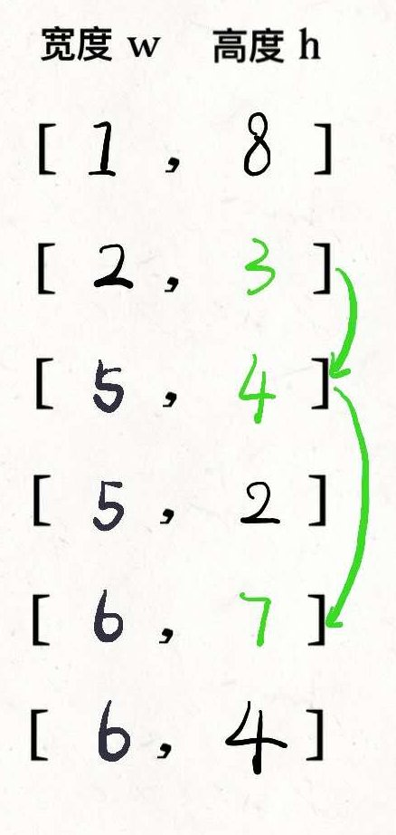

## 俄罗斯套娃信封问题

给定一些标记了宽度和高度的信封，宽度和高度以整数对形式 (w, h) 出现。当另一个信封的宽度和高度都比这个信封大的时候，这个信封就可以放进另一个信封里，如同俄罗斯套娃一样。

请计算最多能有多少个信封能组成一组“俄罗斯套娃”信封（即可以把一个信封放到另一个信封里面）。

说明:
不允许旋转信封。

示例:

```
输入: envelopes = [[5,4],[6,4],[6,7],[2,3]]
输出: 3
解释: 最多信封的个数为 3, 组合为: [2,3] => [5,4] => [6,7]。
```

## 方法 1：暴力循环

### 分析

 对所有信封以宽高先进行一个排序，然后从小的包，依次向上寻找可以装下的信封



这个解法的关键在于，对于宽度 w 相同的数对，要对其高度 h 进行降序排序。因为两个宽度相同的信封不能相互包含的，逆序排序保证在 w 相同的数对中最多只选取一个。

然后运用动态规划求第 i 个信封的最大存放数量

例如，`i`信封可装下的最大信封数为`num(i)`， 若`i`信封可以装下 `i-1`信封，那么其中 i 可装的信封可选项就可能有`num(i - 1)+1`, 若还存在`i-2`也能装下，那么此时得到：

```
num(i) = Math.max(num(i - 1), num(i - 2)) + 1;
```

同时还需要记录一个 max 字段，在每次找出 num(i)的时候进行一个对比替换

### 解答

```javascript
var maxEnvelopes = function(envelopes) {
  let max = 0;
  const newArray = envelopes.sort((a, b) => a[0] - b[0] || b[1] - a[1]);
  // 拟定一个0宽度，0高度，0个最大存放信封的数组
  newArray.unshift([0, 0, 0]);
  for (let i = 1; i < newArray.length; i++) {
    const current = newArray[i];
    let item = [];
    let flag = false;
    // 依次向上进行循环，找出可以存放进当前元素的信封。
    for (let j = i - 1; j >= 0; j--) {
      if (current[1] > newArray[j][1]) {
        // 若当前数 === max，由于运算中只需要 +1，因此必定就是最大值，此时就可以跳出该项的循环
        if (newArray[j][2] === max) {
          flag = true;
          max = current[2] = newArray[j][2] + 1;
          break;
        }
        item.push(newArray[j][2]);
      }
    }
    // 得出当前项可存放的最大信封数
    if (!flag) {
      newArray[i][2] = Math.max.apply(null, item) + 1;
    }
  }
  return max;
};
```

## 方法 2：动态规划

### 分析

参考：[纸牌游戏](https://leetcode-cn.com/problems/longest-increasing-subsequence/solution/dong-tai-gui-hua-she-ji-fang-fa-zhi-pai-you-xi-jia/)  
确保每一列数的尾数是当前最小的，才能够构成从第0到第n列能形成连续的递增数   
### 解答

```javascript
var maxEnvelopes = function(envelopes) {
  let max = 0;
  const newArray = envelopes.sort((a, b) => a[0] - b[0] || b[1] - a[1]);
  const dp = [];
  for (let i = 0; i < newArray.length; i++) {
    const curr = newArray[i][1];
    let flag = false;
    for (let j = 0; j < dp.length; j++) {
      if (dp[j] >= curr) {
        flag = true;
        dp[j] = curr;
        break;
      }
    }
    if (!flag) {
      dp.push(curr);
    }
  }
  return dp.length;
};
```
