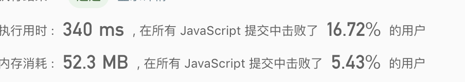
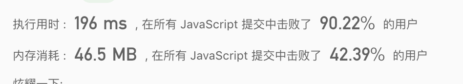

## 字母异位词分组

给定一个字符串数组，将字母异位词组合在一起。字母异位词指字母相同，但排列不同的字符串。

示例:

```
输入: ["eat", "tea", "tan", "ate", "nat", "bat"],
输出:
[
  ["ate","eat","tea"],
  ["nat","tan"],
  ["bat"]
]
```

说明：

所有输入均为小写字母。
不考虑答案输出的顺序。

## 解法1：排序每个字符串

### 分析
循环排序检查重复的元素，以排序后的字符串为 key

### 解答

```javascript
var groupAnagrams = function(strs) {
  const map = {};
  for (let item of strs) {
    const format = item
      .split('')
      .sort()
      .toString();
    if (map[format]) {
      map[format].push(item);
    } else {
      map[format] = [item];
    }
  }
  return Object.values(map);
};
```

结果：


## 解法2：求字符hash

### 分析
跟解法1类似，但是是统计每个字母的charCode，先制造一个存放26位字母的数组，每个元素都为0，在循环字母中，出现哪个字母就在数组对应的下标中+1，后续再将数组转化为字符串，即为字符hash。  
以字符hash去取相同的hash即可。  

## 解答
```javascript
var groupAnagrams = function(strs) {
  const res = {};
  const keys = [];
  for (let i = 0; i < strs.length; i++) {
    const item = strs[i];
    const array = new Uint8Array(26);
    for (let j = 0; j < item.length; j++) {
      // +1 是为了处理重复的字段 例如：boo、obb
      array[item.charCodeAt(j) - 97] += 1;
    }
    const key = array.join('');
    if (res[key]) {
      res[key].push(item);
    } else {
      res[key] = [item];
    }
  }
  return Object.values(res);
};
```


由于不需要排序字符串，在时间和空间中都节约不少
