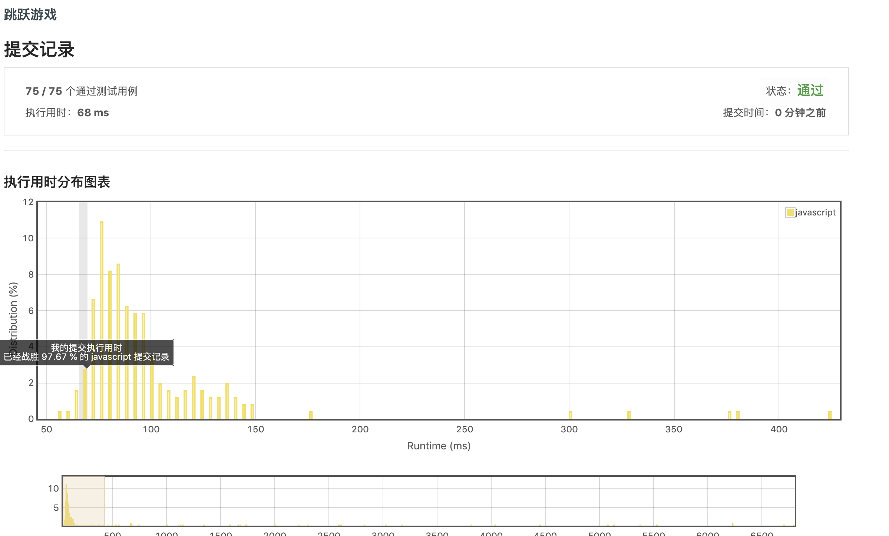

给定一个非负整数数组，你最初位于数组的第一个位置。

数组中的每个元素代表你在该位置可以跳跃的最大长度。

判断你是否能够到达最后一个位置。

示例 1:

```
输入: [2,3,1,1,4]
输出: true
解释: 从位置 0 到 1 跳 1 步, 然后跳 3 步到达最后一个位置。
```

示例 2:

```
输入: [3,2,1,0,4]
输出: false
解释: 无论怎样，你总会到达索引为 3 的位置。但该位置的最大跳跃长度是 0 ， 所以你永远不可能到达最后一个位置。
```

只需要知道是否能到达最后一位，因此满足条件 ``最大可走步数`` >= ``总长度`` 即可， 需要循环数组中的每一个数，计算当前可行走的最大步数。这里运用贪心算法来进行运算。
另外如果数组中没有0的话，不管怎么走都可以到终点
```javascript
var canJump = function(nums) {
  if (!nums.includes(0)) return true;   // 如果没有0，则直接为true
  let reach = 0;    // 初始化最大可走步数
  for (let i = 0; i < nums.length; i++) {
    if (reach < i || reach >= nums.length - 1) break;   // reach < i 情况一定是出现了0，因此最大值小于当前下标。
    reach = Math.max(reach, i + nums[i]);   
  }
  return reach >= nums.length - 1;
};
```


