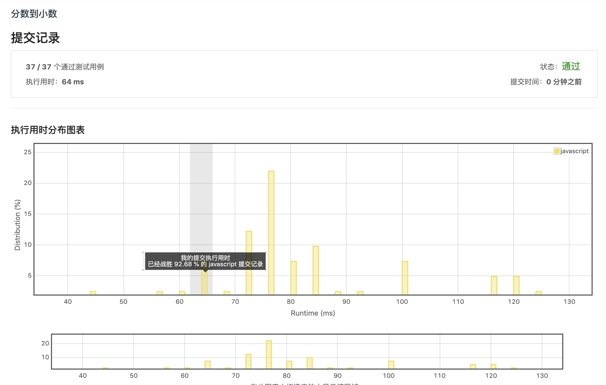

## 分数到小数

给定两个整数，分别表示分数的分子 numerator 和分母 denominator，以字符串形式返回小数。

如果小数部分为循环小数，则将循环的部分括在括号内。

示例 1:

```
输入: numerator = 1, denominator = 2
输出: "0.5"
```

示例 2:

```
输入: numerator = 2, denominator = 1
输出: "2"
```

示例 3:

```
输入: numerator = 2, denominator = 3
输出: "0.(6)"
```

From: [分数到小数](https://leetcode-cn.com/submissions/detail/49124946/)

## 分析

如果该数是可以被整除的，那么最后出现的余数肯定为 0。  
若是无限循环小数，只需要判断当前余数是否和之前出现的余数一致即可。  
因此需要保留之前的余数集合，一位一位去除

## 解答

```javascript
var fractionToDecimal = function(numerator, denominator) {
  if (denominator === 1) return numerator + '';
  if (numerator === 0) return '0';
  // 先将除数和被除数都转换为正数，保留最后的负号
  const flag = (numerator < 0 && denominator > 0) || (numerator > 0 && denominator < 0);
  numerator = Math.abs(numerator);
  denominator = Math.abs(denominator);
  // 小数点位数
  let digits = 0;
  // 余数Map, 由原来的数组改成对象查找
  const numeraMap = {};
  // 商集合
  let res = [];
  while (numerator !== 0) {
    // 注意这里需要先除再计算是否需要进位！
    const quotient = Math.floor(numerator / denominator);
    numerator %= denominator;
    res.push(quotient);
    const isIndex = numeraMap[numerator];
    // 若之前出现过该余数则为无限循环小数，提取其中循环字段即可
    if (isIndex >= 0) {
      const decimals = res.splice(0, isIndex + 1);
      digits -= res.length - 1;
      decimals.push(`(${res.join('')})`);
      res = decimals;
      break;
    }
    numeraMap[numerator] = digits;
    // 若余数小于除数，则小数部分退1位
    if (0 < numerator && numerator < denominator) {
      numerator *= 10;
      digits++;
    }
  }
  if (flag) {
    res.unshift('-');
  }
  // 补上小数点
  if (digits !== 0) {
    res.splice(res.length - digits, 0, '.');
  }
  return res.join('');
};
```

##  结果


