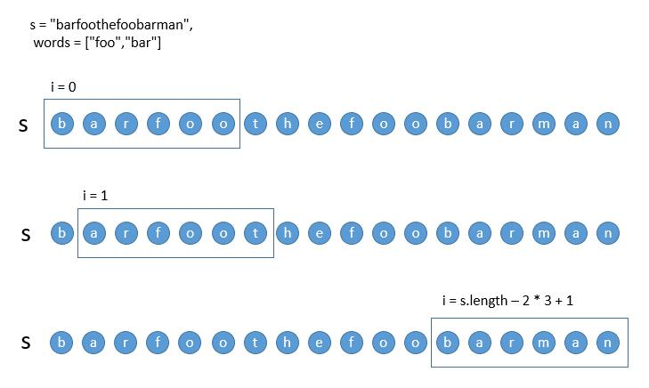

## 串联所有单词的子串

给定一个字符串  s  和一些长度相同的单词  words。找出 s 中恰好可以由  words 中所有单词串联形成的子串的起始位置。

注意子串要与  words 中的单词完全匹配，中间不能有其他字符，但不需要考虑  words  中单词串联的顺序。

示例 1：

```
输入：
  s = "barfoothefoobarman",
  words = ["foo","bar"]
输出：[0,9]
解释：
从索引 0 和 9 开始的子串分别是 "barfoor" 和 "foobar" 。
输出的顺序不重要, [9,0] 也是有效答案。
```

示例 2：

```
输入：
  s = "wordgoodgoodgoodbestword",
  words = ["word","good","best","word"]
输出：[]
```
From: [串联所有单词的子串](https://leetcode-cn.com/problems/substring-with-concatenation-of-all-words/submissions/)
## 分析

通过滑动窗口来取出指定长度的字符串  
由于 words 是个长度相等的数组，因此满足其条件长度需要为：words[ 0 ].length \* words.length  
因此便可以以这个长度进行窗口滑动  
例如：  


每次移动一个单位，寻找匹配的字符串

然后就是比较组合数，这里考虑到在 words 数组中可能有多种组合，但是可能存在重复的组合，为了避免重复组合可以采用两种方式：  
1、set 集合+有序组合  
2、键值映射，只考虑字符串 name 和出现的次数 n  
这里采用第二种方式，如果窗口字符串和键值映射一致，则代表该窗口的字符串符合条件

## 解答

```javascript
var findSubstring = function(s, words) {
  if (!s.length || !words.length) return [];
  const res = [];
  const map = {};
  // 得到单词和出现次数的映射
  for (let i = 0; i < words.length; i++) {
    map[ words[ i ] ] = ~~map[ words[ i ] ] + 1;
  }
  const gap = words[0].length;
  const len = s.length - gap * words.length;
  let i = 0;
  // 由于这里最后一位 s[ len ] 最后还有 words.length * words[ 0 ].length 个长度，因此最后要算上 len，所以是 i <= len
  while (i <= len) {
    const mapItem = Object.assign({}, map);
    let flag = true;
    // 以窗口字符串中继续套窗口进行位移，其中窗口字符串的长度为 words.length * words[ 0 ].length
    for (let j = 0; j < words.length; j++) {
      const str = s.slice(i + j * gap, i + (j + 1) * gap);
      // 如果出现该字符串并且当前次数大于0，则减一，如果不存在或小于0，则已经不匹配目标的次数频率，则直接抛出
      if (mapItem[str] && mapItem[str] > 0) {
        mapItem[str]--;
      } else {
        flag = false;
        break;
      }
    }
    // 校验是否都为0，如果符合则把当前坐标推入结果
    if (flag && Object.values(mapItem).every(item => item === 0)) {
      res.push(i);
    }
    i++;
  }
  return res;
};
```
