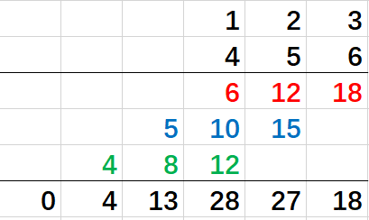

## 字符串相乘

给定两个以字符串形式表示的非负整数 num1 和 num2，返回 num1 和 num2 的乘积，它们的乘积也表示为字符串形式。

示例 1:

输入: num1 = "2", num2 = "3"
输出: "6"
示例 2:

输入: num1 = "123", num2 = "456"
输出: "56088"
说明：

num1 和 num2 的长度小于 110。
num1 和 num2 只包含数字 0-9。
num1 和 num2 均不以零开头，除非是数字 0 本身。
不能使用任何标准库的大数类型（比如 BigInteger）或直接将输入转换为整数来处理。  

From: [字符串相乘](https://leetcode-cn.com/problems/multiply-strings/submissions/)
## 分析

可以每一位循环相乘，相同位进行相加。最后得到每一位的值。（想不管该位的值是否>10）
  
然后每一位再相加，即：

```
每一位的值 =（当前位数字+上一位余数）% 10
当前位的余数（即进位） = Math.floor(（当前位数字 + 上一位余数）/ 10);
```

## 解答
```javascript
var multiply = function(num1, num2) {
  if (num1 === '0' || num2 === '0') return '0';
  // 如果长度都小于9，则得出来的数字不属于bigNumber,因此可以直接计算
  if (num1.length < 9 && num2.length < 9) {
    return num1 * num2 + '';
  }
  // 得到每一位的数字
  const map = [];
  for (let i = 0; i < num1.length; i++) {
    const currI = num1.length - 1 - i;
    for (let j = 0; j < num2.length; j++) {
      const currJ = num2.length - 1 - j;
      console.log(currI, currJ);
      map[i + j] = (map[i + j] || 0) + num1[currI] * num2[currJ];
    }
  }
  // 重新计算每一位，得到进位，依次循环相加。
  let digit = 0;
  let i = 0;
  while (map[i] >= 0 || digit) {
    map[i] = ~~map[i] + digit;
    digit = map[i] >= 10 ? parseInt(map[i] / 10) : 0;
    map[i] %= 10;
    i++;
  }
  // 由于低位数在前，因此需要反转数组
  return map.reverse().join('');
};
```

## 复杂度：  
时间复杂度：O(m\*n+S) S 为得出结果 strArray 的长度  
空间复杂度：O(S)
