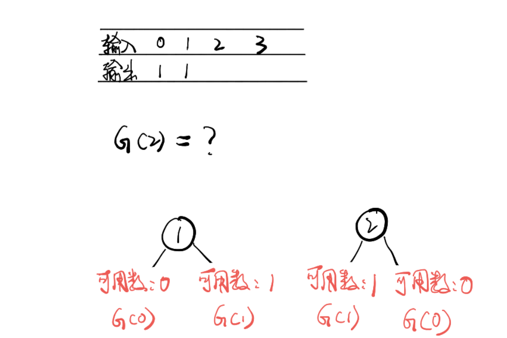

## 不同的二叉搜索树

给定一个整数 n，求以  1 ... n  为节点组成的二叉搜索树有多少种？

示例:

```
输入: 3
输出: 5
解释:
给定 n = 3, 一共有 5 种不同结构的二叉搜索树:

   1         3     3      2      1
    \       /     /      / \      \
     3     2     1      1   3      2
    /     /       \                 \
   2     1         2                 3
```

## 分析

通过动态规划来解决：
因为通过不同的结构来区分种类，而不用数字的大小排列顺序  
已知:

```
n = 0   res = 1
n = 1   res = 1
```

当 n = 2

```
即 G(2) = G(0) * G(1) + G(1) * G(0)
```

n = 3

```
G(3) = G(0) * G(2) + G(1) * G(1) + G(2) * G(0)
```

综合得：

```
G(n)=G(0)*G(n−1)+G(1)*(n−2)+...+G(n−1)*G(0)
```

From: [不同的二叉搜索树](https://leetcode-cn.com/problems/unique-binary-search-trees/)
## 解答

```javascript
var numTrees = function(n) {
  const dp = [1, 1];
  for (let i = 2; i <= n; i++) {
    for (let j = 0; j < i; j++) {
      dp[i] = ~~dp[i] + dp[j] * dp[i - 1 - j];
    }
  }
  return dp[dp.length - 1];
};
```
