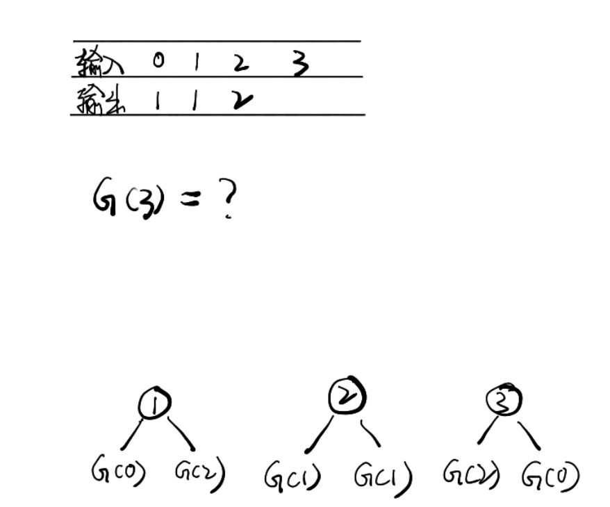

## 不同的二叉搜索树

给定一个整数 n，求以  1 ... n  为节点组成的二叉搜索树有多少种？

示例:

```
输入: 3
输出: 5
解释:
给定 n = 3, 一共有 5 种不同结构的二叉搜索树:

   1         3     3      2      1
    \       /     /      / \      \
     3     2     1      1   3      2
    /     /       \                 \
   2     1         2                 3
```

### 分析

通过动态规划来解决：
因为通过不同的结构来区分种类，而不用数字的大小排列顺序  
已知:

```
n = 0   res = 1
n = 1   res = 1
```

当 n = 2

```
即 G(2) = G(0) * G(1) + G(1) * G(0)
```

n = 3

```
G(3) = G(0) * G(2) + G(1) * G(1) + G(2) * G(0)
```

综合得：

```
G(n)=G(0)*G(n−1)+G(1)*(n−2)+...+G(n−1)*G(0)
```

From: [不同的二叉搜索树](https://leetcode-cn.com/problems/unique-binary-search-trees/)
### 解答

```javascript
var numTrees = function(n) {
  const dp = [1, 1];
  for (let i = 2; i <= n; i++) {
    for (let j = 0; j < i; j++) {
      dp[i] = ~~dp[i] + dp[j] * dp[i - 1 - j];
    }
  }
  return dp[dp.length - 1];
};
```

## 不同的二叉搜索树 II
给定一个整数 n，生成所有由 1 ... n 为节点所组成的 二叉搜索树 。

 

示例：
```
输入：3
输出：
[
  [1,null,3,2],
  [3,2,null,1],
  [3,1,null,null,2],
  [2,1,3],
  [1,null,2,null,3]
]
```
解释：
以上的输出对应以下 5 种不同结构的二叉搜索树：
```
   1         3     3      2      1
    \       /     /      / \      \
     3     2     1      1   3      2
    /     /       \                 \
   2     1         2                 3
```

提示：
```
0 <= n <= 8
```

From: [不同的二叉搜索树 II](https://leetcode-cn.com/problems/unique-binary-search-trees-ii)

### 分析
此题需要得到所有的二叉树类型，通过深度遍历来得到每个节点可以衔接的数组节点。  
首先在遍历中，通过二叉搜索树的特性，`leftTree < root < rightTree`，因此在遍历中只要遵循这个，例如n = 3
```
遍历数为：1   leftArr: []  rightArr: [2, 3, 4]
遍历数为：2   leftArr: [1]  rightArr: [3]
遍历数为：3   leftArr: [1,2]  rightArr: []
```
其中`leftArr`和`rightArr`再通过同样的方式递归遍历则可得出

### 解答
```javascript
var generateTrees = function(n) {
  if (n === 0) return [];
  return helper(1, n);
  function helper(start, end) {
    if (start > end) return [ null ];
    const res = [];
    for (let i = start; i <= end; i++) {
      const LeftArr = helper(start, i - 1);
      const RightArr = helper(i + 1, end);
      for (let ln of LeftArr) {
        for (let rn of RightArr) {
          const root = new TreeNode(i);
          root.left = ln;
          root.right = rn;
          res.push(root);
        }
      }
    }
    return res;
  }
};
```