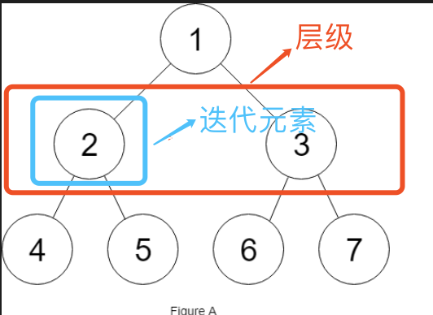

## 填充每个节点的下一个右侧节点指针

给定一个完美二叉树，其所有叶子节点都在同一层，每个父节点都有两个子节点。二叉树定义如下：

```
struct Node {
  int val;
  Node *left;
  Node *right;
  Node *next;
}
```

填充它的每个 next 指针，让这个指针指向其下一个右侧节点。如果找不到下一个右侧节点，则将 next 指针设置为 NULL。

初始状态下，所有 next 指针都被设置为 NULL。

示例：


```
输入：
{"$id":"1","left":{"$id":"2","left":{"$id":"3","left":null,"next":null,"right":null,"val":4},"next":null,"right":{"$id":"4","left":null,"next":null,"right":null,"val":5},"val":2},"next":null,"right":{"$id":"5","left":{"$id":"6","left":null,"next":null,"right":null,"val":6},"next":null,"right":{"\$id":"7","left":null,"next":null,"right":null,"val":7},"val":3},"val":1}

输出：
{"$id":"1","left":{"$id":"2","left":{"$id":"3","left":null,"next":{"$id":"4","left":null,"next":{"$id":"5","left":null,"next":{"$id":"6","left":null,"next":null,"right":null,"val":7},"right":null,"val":6},"right":null,"val":5},"right":null,"val":4},"next":{"$id":"7","left":{"$ref":"5"},"next":null,"right":{"$ref":"6"},"val":3},"right":{"$ref":"4"},"val":2},"next":null,"right":{"\$ref":"7"},"val":1}

```

解释：给定二叉树如图 A 所示，你的函数应该填充它的每个 next 指针，以指向其下一个右侧节点，如图 B 所示。

提示：

你只能使用常量级额外空间。
使用递归解题也符合要求，本题中递归程序占用的栈空间不算做额外的空间复杂度。

## 解法 1：广度搜索+索引记录

### 分析

通过后续遍历，以每一层为索引拿到一次出现的数，其中 同样的索引的`node.next`等于一次同样索引的`node`, 直到为`null`

### 解答

```javascript
/**
 * // Definition for a Node.
 * function Node(val,left,right,next) {
 *    this.val = val;
 *    this.left = left;
 *    this.right = right;
 *    this.next = next;
 * };
 */
/**
 * @param {Node} root
 * @return {Node}
 */
var connect = function(root) {
  const cacheNode = [];
  function getTree(root, index) {
    if (!root) return;
    getTree(root.left, index + 1);
    getTree(root.right, index + 1);
    if (cacheNode[index]) cacheNode[index].next = root;
    cacheNode[index] = root;
  }
  getTree(root, 1);
  return root;
};
```

## 方法 2：迭代

### 分析

由于解法 1 受空间限制，不符合题解，由此不适用  
参考网上的题解，可以用迭代来解决  


 又两层循环来解决  
外层`index`主要是迭代层级，由于是个完美二叉树，每次只用取树的最左侧就行了，因此迭代条件为
```
index = index.left   
```
内层`curr`主要是迭代内部的元素，其子元素的连接状态为
```
curr.left.next = curr.right
```
那么跨树之间如何解决呢？  
粗略表达起来就是  
```
curr.right.next = curr.parent.right.left;
```
在嵌套如此深的环境下若要找寻`curr.parent`恐怕会涉及更多的运算，但是仅仅是取`curr.parent.right`的话，仔细一想，是否在迭代子树之前，父树左右已经依靠next就已经经建立联系了, 父树的关系即为：  
```
left.next = right
```
那么跨子树之间的联系即可得到:  
```
curr.right.next = curr.next.left;
```
### 解答

```javascript
var connect = function(root) {
  if (!root) return null;
  let index = root;
  let curr = index;
  // 迭代层级
  while (index.left) {
    curr = index;
    // 迭代父级元素，连接子树
    while (curr) {
      curr.left.next = curr.right;
      if (curr.next) curr.right.next = curr.next.left;
      curr = curr.next;
    }
    index = index.left;
  }
  return root;
};
```
