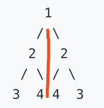

## 对称二叉树
给定一个二叉树，检查它是否是镜像对称的。


例如，二叉树 [1,2,2,3,4,4,3] 是对称的。
```
    1
   / \
  2   2
 / \ / \
3  4 4  3
```

但是下面这个 [1,2,2,null,3,null,3] 则不是镜像对称的:
```
    1
   / \
  2   2
   \   \
   3    3
```

进阶：

你可以运用递归和迭代两种方法解决这个问题吗？

From: [对称二叉树](https://leetcode-cn.com/problems/symmetric-tree)

## 方法1：递归

### 分析
从递归的角度解决，观测树的中应该比较元素的位置。其中可以以根节点为中心，往左右两节点扩散，比较原则为：



+ 根节点下的左节点和右节点必须相同，包括同时为空的情况。
+ `左节点下的右节点` 和 `右节点下的左节点` 需要相同，可以看做以中心为对称相比较
+ 同样，向外扩散的节点为：`左节点下的左节点` 和 `右节点下的右节点` 需要相同

### 解答
```javascript
var isSymmetric = function(root) {
  if (!root) return true;
  return check(root.left, root.right);
  
  function check(left, right) {
    if (!left && !right) return true;
    if (left && !right || !left && right) return false;
    return left.val === right.val && check(left.right, right.left) && check(left.left, right.right);
  }
};
```

## 方法2：循环

### 分析
通过广度优先遍历BFS，获得每一层的值，比较当前层的值是否对称。其中这里运用的比较的方法是建立两个字符串，一个字符串向后推入值，另一个字符串向前推入，最终就是比较这两个字符串是否相同。需要注意的是，如果是当前层的空节点，可以利用`#`来做占位字符。

### 解答
```javascript
var isSymmetric = function(root) {
  let queue = [ root ];
  while(queue.length) {
    let forwardStr = '';
    let reverseStr = '';
    let temp = [];
    for (let item of queue) {
      if (item) {
        temp.push(item.left);
        temp.push(item.right);
      }
      forwardStr += (item ? item.val : '#');
      reverseStr = (item ? item.val : '#') + reverseStr;
    }
    // 比较两字符，若不相同则直接返回false
    if (forwardStr !== reverseStr) return false;
    queue = temp;
  }
  return true;
};
```