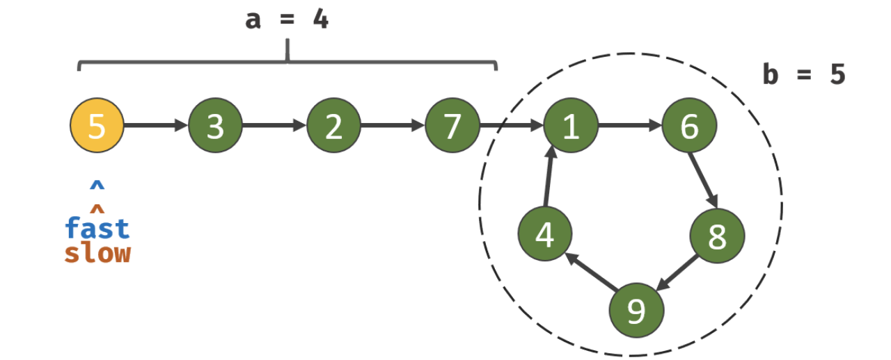

## 环形链表 II

给定一个链表，返回链表开始入环的第一个节点。 如果链表无环，则返回 null。

为了表示给定链表中的环，我们使用整数 pos 来表示链表尾连接到链表中的位置（索引从 0 开始）。 如果 pos 是 -1，则在该链表中没有环。

说明：不允许修改给定的链表。

示例 1：

```
输入：head = [3,2,0,-4], pos = 1
输出：tail connects to node index 1
解释：链表中有一个环，其尾部连接到第二个节点。
```


示例 2：

```
输入：head = [1,2], pos = 0
输出：tail connects to node index 0
解释：链表中有一个环，其尾部连接到第一个节点。
```


示例 3：

```
输入：head = [1], pos = -1
输出：no cycle
解释：链表中没有环。
```


进阶：
你是否可以不用额外空间解决此题？

## 分析

可以用快慢指针。  
假设快指针`fast`每次走两次，慢指针`slow`每次走一次  
 如果``fast``走到尽头，则该链表没有形成环形，则直接抛出 null 即可  
 如果`fast`和`slow`相遇了，则代表属于环形链表  
假设在<b>链表头部到链表入口</b>，所需要走的节点数为`a`, <b>链表环</b>的节点数为`b`，那么：  
`fast`指针走的步数可归纳为：

- f = 2s (快指针是慢指针的两倍长度)
- f = s + nb (快指针比慢指针多走了 n 圈环)  

由此可得：s = nb;  
如果指针依旧往前走，那么 `a` 是等于后面的 `a + 1b`、`a + 2b` 、... `a + nb`  
那么 此时 慢指针已经走了`nb`了，若再往前走 a 步，即可得到循环的起点，若需要计算出 a，需要将`fast`指针重置为 head 位置，并且`fast`和`slow`同时以 1 位步进，当再次相遇时，即可得出步进到``a``时的位置



## 解答

```javascript
var detectCycle = function(head) {
  let slow = head;
  let fast = head;
  while (fast && fast.next) {
    slow = slow.next;
    fast = fast.next.next;
    if (slow === fast) {
      fast = head;
      while (fast !== slow) {
        fast = fast.next;
        slow = slow.next;
      }
      return fast;
    }
  }
  return null;
};
```
