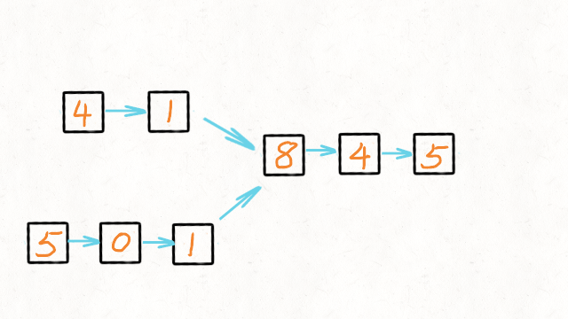

## 相交链表

编写一个程序，找到两个单链表相交的起始节点。

如下面的两个链表：


在节点 c1 开始相交。  

示例 1：  


```
输入：intersectVal = 8, listA = [4,1,8,4,5], listB = [5,0,1,8,4,5], skipA = 2, skipB = 3

输出：Reference of the node with value = 8

输入解释：相交节点的值为 8 （注意，如果两个列表相交则不能为 0）。从各自的表头开始算起，链表 A 为 [4,1,8,4,5]，链表 B 为 [5,0,1,8,4,5]。在 A 中，相交节点前有 2 个节点；在 B 中，相交节点前有 3 个节点。
```

示例 2：  


```
输入：intersectVal = 2, listA = [0,9,1,2,4], listB = [3,2,4], skipA = 3, skipB = 1

输出：Reference of the node with value = 2

输入解释：相交节点的值为 2 （注意，如果两个列表相交则不能为 0）。从各自的表头开始算起，链表 A 为 [0,9,1,2,4]，链表 B 为 [3,2,4]。在 A 中，相交节点前有 3 个节点；在 B 中，相交节点前有 1 个节点。
```

示例 3：  


```
输入：intersectVal = 0, listA = [2,6,4], listB = [1,5], skipA = 3, skipB = 2

输出：null

输入解释：从各自的表头开始算起，链表 A 为 [2,6,4]，链表 B 为 [1,5]。由于这两个链表不相交，所以 intersectVal 必须为 0，而 skipA 和 skipB 可以是任意值。
解释：这两个链表不相交，因此返回 null。
```

注意：  
如果两个链表没有交点，返回 null.  
在返回结果后，两个链表仍须保持原有的结构。  
可假定整个链表结构中没有循环。  
程序尽量满足 O(n) 时间复杂度，且仅用 O(1) 内存。  


## 分析
若两个链表有共同的节点，则必定存在这种情况：两个链表长度相等或其中一条较长。  
假设长链表的长度为：A    
短链表的长度为：B  
两个链表一致的长度为：X  

若长链表和短链表长度一致，即A = B，则可以循环里面每个节点  
但长度不一致，则需要在长链表中需要先走出和短表的差值步数后，再比较节点。差值节点步数即为：A-B。  

需要得出差值步数可以利用双指针来解决，两个链表同时走，若其中一个链表到达末端，则另外一个则是长链表。此时若长链表再次步进到末端的次数则是两个链表的差值。  
两个指针再次从头步进，此刻需要从已知的长链表先步进A-B次，则再进行比较即可  


From: [相交链表](https://leetcode-cn.com/problems/intersection-of-two-linked-lists/)
## 解答
```javascript
/**
 * @param {ListNode} headA
 * @param {ListNode} headB
 * @return {ListNode}
 */
var getIntersectionNode = function(headA, headB) {
  let currA = headA;
  let currB = headB;
  while (currA && currB) {
    currA = currA.next;
    currB = currB.next;
    // 若其中有1个链表走到尽头
    if (!(currA && currB)) {
      // 得知长链表
      let longNode = currA ? headA : headB;
      // 短链表
      let shortNode = currA ? headB : headA;
      // 当前还在行进的长链表中的当前节点
      let existNode = currA || currB;
      while (existNode) {
        // 长链表从头走A-B差值
        longNode = longNode.next;
        existNode = existNode.next;
      }
      // 依次比较
      while (longNode !== shortNode) {
        longNode = longNode.next;
        shortNode = shortNode.next;
      }
      return longNode;
    }
  }
  return null;
};
```
