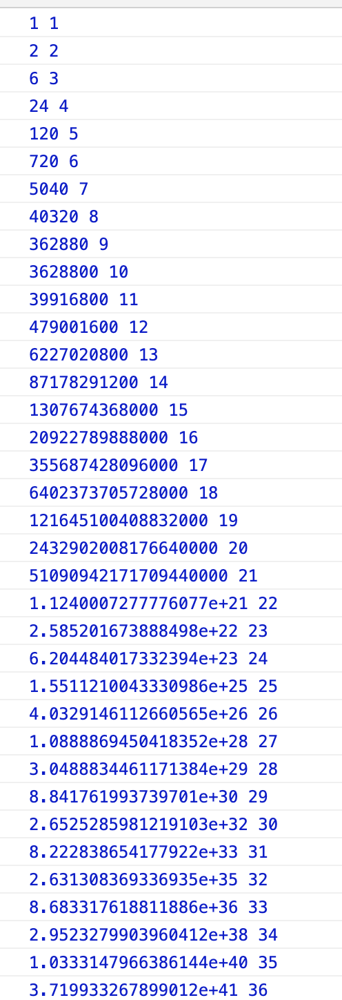

## 阶乘后的零

给定一个整数 n，返回 n! 结果尾数中零的数量。

示例 1:

```
输入: 3
输出: 0
解释: 3! = 6, 尾数中没有零。
```

示例 2:

```
输入: 5
输出: 1
解释: 5! = 120, 尾数中有 1 个零.
说明: 你算法的时间复杂度应为 O(log n) 。
```

## 分析

如果需要得到阶乘后的值，当 n 到达 22 的时候就会变成科学技术。
  
因此这个方法是不行的。  
另外一种思路：  
由于这里需要找到末尾 0 的个数，当其中几个数达到最小乘积为 10 的时候就会增加一个 0，因此这里需要找到 10 的最小公约数。可知是 2 和 5。  
所以需要满足 2 和 5 都同时存在的情况下则可以增加一个 0，同时 5 出现的几率比 2 要小，因此以出现 5 的几率为准，换言之，只要该值能被 5 整除就可以  增加一个 0。  
例如：

```
以 10 为例：
1*2*3*4*5*6*7*8*9*10

其中能被5整除的有：5、10
结果为2

再以25为例：
其中能被5整除的有：5、10、15、20、25
但由于其中的25可以被分解两个5，因为2的数量远远大于5的数量，因此25是可以被分成5*5，因此就可以被分解成2个5，最后可以得出6个5，因此结果是6
```

## 解答

通过以上可以得出：

```javascript
var trailingZeroes = function(n) {
  let res = 0;
  while (n > 0) {
    n = Math.floor(n / 5);
    res += n;
  }
  return res;
};
```
